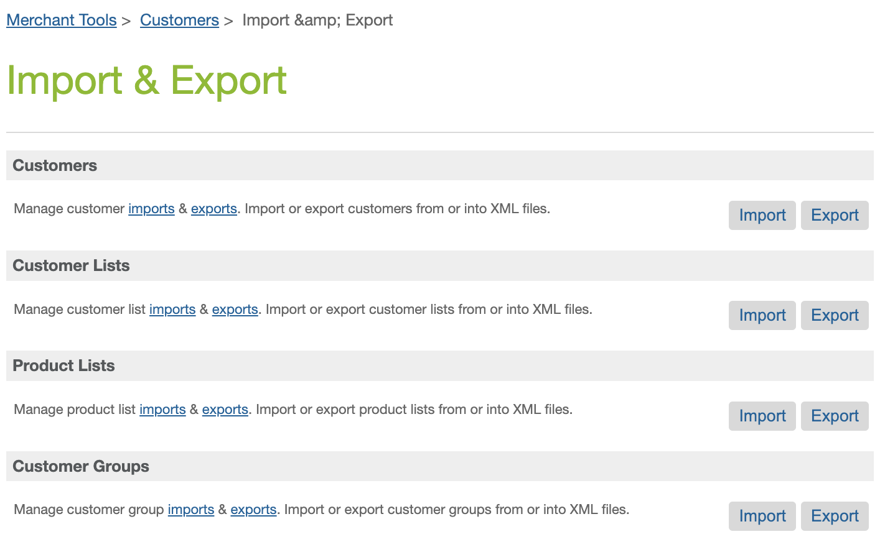
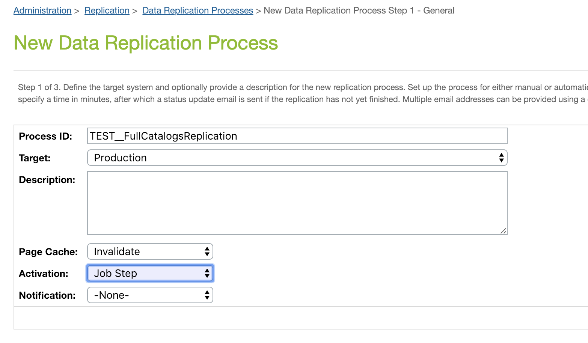
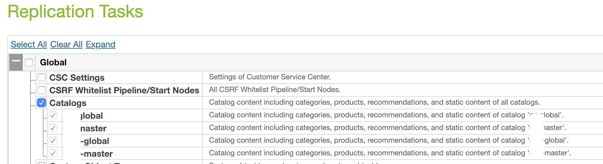
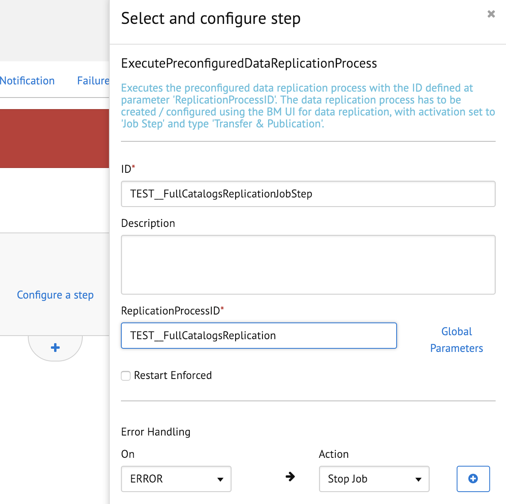
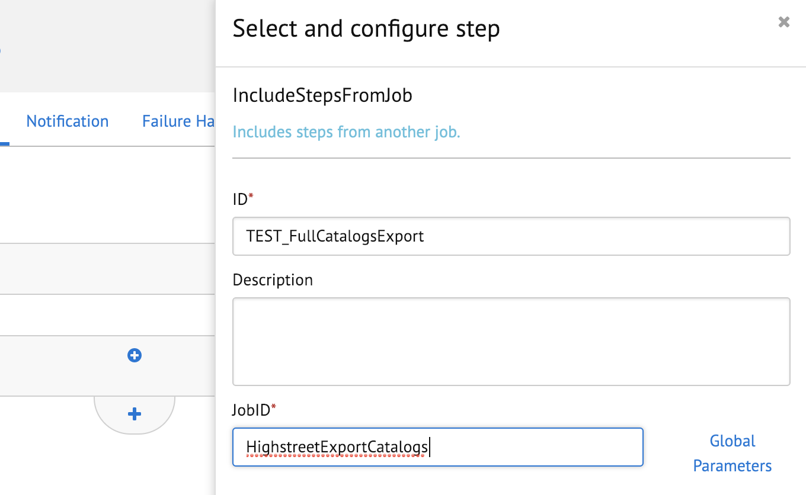

# Highstreet cartridge - Salesforce B2C Commerce

 

> Version 20.1.1

## Table of contents

- [Highstreet cartridge - Salesforce B2C Commerce](#highstreet-cartridge---salesforce-b2c-commerce)
  - [Table of contents](#table-of-contents)
  - [Get started](#get-started)
    - [Highstreet platform](#highstreet-platform)
    - [The cartridge](#the-cartridge)
      - [Compatibility](#compatibility)
      - [Locales support](#locales-support)
    - [Prerequisites](#prerequisites)
    - [Exported data](#exported-data)
  - [Install the cartridge](#install-the-cartridge)
    - [Set up the cartridge path](#set-up-the-cartridge-path)
  - [Generate the job definitions with the cli tool](#generate-the-job-definitions-with-the-cli-tool)
    - [Setup](#setup)
    - [JSON configuration file](#json-configuration-file)
      - [Sample JSON configuration file](#sample-json-configuration-file)
    - [Generate the jobs and the services definitions](#generate-the-jobs-and-the-services-definitions)
  - [Import services definitions](#import-services-definitions)
  - [Import job definitions](#import-job-definitions)
  - [Schedule the export jobs](#schedule-the-export-jobs)
  - [Customer Groups Export](#customer-groups-export)
  - [Verify the installation and Highstreet availability](#verify-the-installation-and-highstreet-availability)
  - [Advanced](#advanced)
    - [Export on data replication](#export-on-data-replication)
      - [Catalogs - staging](#catalogs---staging)
        - [create the data replication process](#create-the-data-replication-process)
        - [job configuration](#job-configuration)
          - [replication execution](#replication-execution)
          - [execute the highstreet job](#execute-the-highstreet-job)
    - [Manually configure the job step custom.HighstreetProductsFeed](#manually-configure-the-job-step-customhighstreetproductsfeed)
      - [Job step customization](#job-step-customization)

## Get started

### Highstreet platform

Highstreet ([https://www.highstreet.io/](https://www.highstreet.io/)) is a solution that helps  the Merchants in the distribution of products and stock to multiple channels. It takes the hassle out of data feed management with the managed service that handles the optimization, synchronization, and approvals of your products across all of your shopping channels.

### The cartridge

The Highstreet cartridge is a solution for exporting data from Salesforce B2C Commerce to the Highstreet service. The service can process the standard Salesforce B2C Commerce import/export file formats, and this integration provides:

- a cartrdige that provides a custom Job step for exporting the URLs of the product pages and images; the generated file has a custom format
- a command-line utility that generates the Jobs and Services definitions out of a simple JSON configuration file

#### Compatibility

The recommended minimum compatibility mode is 18.2. The cartridge does not depend on any specific storefront implementation.

- **Site Genesis**
  - Full compatibility with Sitegenesis.

- **SFRA**
  - Full compatibility with any SFRA version.

#### Locales support

The cartridge supports any locale configured in Business Manager.

### Prerequisites

Before you begin to integrate B2C Commerce with the Highstreet, make sure that you have:

- Got in touch with Highstreet (at [https://www.highstreet.io/](https://www.highstreet.io/))
- Got a highstreet account
- Got the cartridge from any of the following sources:
  - Directly from (zip file) from Highstreet
  - the LINK Marketplace ([https://www.salesforce.com/products/commerce-cloud/partner-marketplace/partners/kipcast/](https://www.salesforce.com/products/commerce-cloud/partner-marketplace/partners/kipcast/))
  - Saleforce Commerce Cloud Github page ([https://github.com/SalesforceCommerceCloud](https://github.com/SalesforceCommerceCloud))

### Exported data

The integration between Salesforce B2C Commerce Cloud and Highstreet typically consists of exporting the following data:

- master catalog (for the products data)
- storefront catalog (for the visibility and categories tree)
- pricebooks
- promotions (for the sale price when a pricebook is not used)
- inventory (for the stock levels)
- customer groups

## Install the cartridge

The Highstreet cartridge can be used with either Storefront Reference Architecture (SFRA), a controller-based SiteGenesis, or a pipeline-based SiteGenesis.

In a folder, unzip the zip file you downloaded from the Marketplace or received from Highstreet; you have the following folder structure:

```bash
- [base folder]
  - bin              -> contains the command-line utility
  - cartridges
    - int_highstreet -> contains the cartridge
  - documentation    -> contains this documentation
```

The cartridge depends on the `bc_job_components` cartridge that you can:

- automatically download the cartridge by runninig the command `npm run deps:job_components`: the cartridge will be downloaded in the cartridges folder and will uploaded along with the int_highstreet cartridge when using the `npm run upload` command (see below)
- manually download the cartridge from [https://github.com/SalesforceCommerceCloud/job-components](https://github.com/SalesforceCommerceCloud/job-components)

Upload the cartridges in `cartridges/` folder to your realm using one of the following tools:

- create a [dw.json](https://documentation.b2c.commercecloud.salesforce.com/DOC1/topic/com.demandware.dochelp/SFRA/UploadingCode.html) and run the provided npm command `npm run upload`; see [Prerequisites](#prerequisites)
- the command-line utility `sgmf-scripts` ([https://www.npmjs.com/package/sgmf-scripts](https://www.npmjs.com/package/sgmf-scripts))
- Commerce Cloud UX-studio
- VSCode Prophet plugin
- add the cartridges to your codebase / build system and deploy it

### Set up the cartridge path

In order to activate the cartridge and use the Job step provided by it, you have to add the cartridge itself to the cartridges path in the Business Manager.

Add `int_highstreet:bc_job_components` to the cartridges list in:

- the Business Manager Site: open `Administration > Sites > Manage Sites` and click `Business Manager`;
- each of the Sites from which you want the data to be exported towards Highstreet: open `Administration > Sites > Manage Sites` select the site ID and open the tab `Settings`.

The order of the cartridge is not important (unless you want to override the `scripts/productFeed.js` job step) as it does not extend any scripts from any other cartridge.

## Generate the job definitions with the cli tool

In order to help in the setup of the jobs to export needed to export all the data to the Highstreet service, the cartridge provides a command-line utility in the form of an executable node.js ([https://nodejs.org/](https://nodejs.org/)) script.

### Setup

The command-line utility is based on the node.js platform which is downloadable from [https://nodejs.org/](https://nodejs.org/)

When you have node.js installed, run the following command from the terminal in the root of the cartridge you have downloaded:

```bash
npm install
```

### JSON configuration file

Create a new file with the `.json` extension (i.e. a file named `sample_configuration.json` in the folder where you unzip the cartridge).

The configuration file will have the following fields:

- **id**: an arbitrary id that will be used as a base for the ids of the generated jobs and services
- **feeds**: an array of feed objects
  - Feed object definition:
    - **site**: id of the site for which you export the data
    - **locales**: an array of the locales as defined in the Business Manager (i.e. `en_US`)
    - **catalogMaster**: the id of the catalog file with the data of the products
    - **catalogStorefront**: the id of the catalog associated with the site
    - **pricebooks**: an array of the id of the pricebooks used by the sites for the "full" price
    - **pricebooksSale**: an array of the id of the pricebooks used by the sites for the "sale" price
    - **exportPromotions**: a boolean flag; if true the promotions will be exported
    - **imageViewType**: the name of the viewtype to export for a product image
    - **publishingGroup**: used the in combination with **id** to generate the id of the jobs and the services
- **ftp**: definition of the connection to the sandbox and production ftp accounts on which the job has to upload the files. If omitted the services are not generated.
  The **ftp** node has two subnodes:
  - **sandbox**: for the connection to the sandbox environment
  - **production**: for the connection to the production environment

  Each node has this definition:
  - **url**: the URL to the ftp/sftp endpoint
  - **user**: username
  - **password**: password
  - **targetFolder**: the folder to which upload the exported files

- **exportFromEnv**: this section defines from which Salesforce Commerce Cloud environment a type of data (`catalogs`, `priceBooks`, `promotions`, `inventoryLists`) should be exported:
- **production**: an array of types of data that will be exported from the production environment; typically the `inventoryLists` type of data. The jobs generated for the production environment use the _production_ ftp connection.
- **staging**: an array of types of data that will be exported from the staging environment; typically the `catalogs`, `priceBooks` and `promotions` types of data. The jobs generated for the production environment use the _production_ ftp connection.
- **development**: an array of types of data that will be exported from the development environment, in order to test the integration; typically all the types of data are associated to this environment. The jobs generated for the production environment use the _sandbox_ ftp connection.

#### Sample JSON configuration file

This is the sample configuration file for a realm with multiple sites, multiple brand.

```json
{
    "id": "Acme",
    "feeds": [{
            "site": "ACME_US",
            "locales": ["en_US", "es_US", "en_CA", "fr_CA"],
            "catalogMaster": "acme-master",
            "catalogStorefront": "acme-us",
            "priceBook": "acme_us_usd_full",
            "priceBookSale": "acme_us_usd_sale",
            "exportPromotions": false,
            "inventoryList": "acme_us",
            "imageViewType": "large",
            "publishGroup": "acme"
        }, {
            "site": "ACME_EU",
            "locales": ["en_ES", "en_FR", "en_IT"],
            "catalogMaster": "acme-master",
            "catalogStorefront": "acme-eu",
            "priceBook": "acme_eu_eur_full",
            "priceBookSale": "acme_eu_eur_sale",
            "exportPromotions": false,
            "inventoryList": "acme_eu",
            "imageViewType": "large",
            "publishGroup": "acme_eu"
        }, {
            "site": "EMCA_US",
            "locales": ["en_US", "es_US"],
            "catalogMaster": "acme-master",
            "catalogStorefront": "emca-us",
            "priceBook": "emca_us_usd_full",
            "exportPromotions": true,
            "inventoryList": "emca_us",
            "imageViewType": "pdp1",
            "publishGroup": "emca"
        }
    ],
    "ftp": {
        "sandbox": {
            "url": "ftp://sandbox.highstreet.com",
            "user": "1234567890",
            "password": "astrongpassword",
            "targetFolder": "in"
        },
        "production": {
            "url": "ftp://ftp.highstreet.com",
            "user": "1234567890",
            "password": "astrongpassword",
            "targetFolder": "in"
        }
    },
    "exportFromEnv": {
        "production": ["inventoryLists"],
        "staging": ["catalogs", "priceBooks", "promotions"],
        "development": ["inventoryLists", "catalogs", "priceBooks", "promotions"]
    }
}
```

### Generate the jobs and the services definitions

Once you have defined the configuration for your realm, you could then run the command `npm run configure -- -c [path to the json config file]` in the terminal in the base folder, i.e.:

```bash
npm run configure -- -c sample_configuration.json
```

In the folder `import` you will find the following files for each environment:

- `highstreet_jobs_{environment}_{id}.xml`: the xml file with the jobs definitions
- `highstreet_services_{environment}_{id}.xml`: the xml file with the jobs definitions

## Import services definitions

In each of the environment (production, staging, development), in the Business Manager go to `Administration > Operations > Import & Export`, click `upload` under `Import & Export Files` and upload the related services definition file.
Then go back to `Administration > Operations > Import & Export`, click `Import` under `Services`, select the file you have just uploaded and click the button `Import`. Follow the steps.

## Import job definitions

In each of the environment (production, staging, development), in the Business Manager go to `Administration > Operations > Import & Export`, click `upload` under `Import & Export Files` and upload the related jobs definition file.
Then go back to `Administration > Operations > Import & Export`, click `Import` under `Jobs`, select the file you have just uploaded and click the button `Import`. Follow the steps

## Schedule the export jobs

The jobs and services definitions have been now imported to all the environments.
You can now schedule the export jobs to be executed automatically; go to `Administration > Operation > Jobs`, filter the jobs searching for `highstreet` and then for each listed job set a schedule in agreement with the Highstreet team.
Typically the catalogs, pricebooks, promotions and products export jobs could be scheduled to run once per day whilst the inventory job should be scheduled to run more frequently, at least on an hourly basis.

## Customer Groups Export

Customer Groups are essential part to product visibility and promotion targeting: Highsteet integrates Commerce Cloud customer groups, but since no automatic export is available via B2C Commerce API a Customer Groups export is required.

The export can be completed via Business Manager > Merchant Tools > Select Site > Customers > Import & Export



- Select "Export" button in the Customer Groups section
- Hit the "All" pagination option
- Select all customer groups
- Click on "Next"
- Choose an Export File name and click "Export"

The exported xml file storing the site customer groups can be uploaded then to the same SFTP server along with the other exported feeds.

## Verify the installation and Highstreet availability

In order to check that everything is working fine and the jobs, the services and the cartridge are properly configured, please manually do a first run for each job that has been imported or configured. Sometimes at the first run an error on the creation of the output folders in the impex repository may happen: running the job a second time should fix it.
This integration does not depend on the availability of the Highstreet platform: the exported files are put in the remote ftp repository and then processed as soon as possible by Highstreet.

## Advanced

### Export on data replication

The jobs could be associated to the data replication process. In order to not overload the _production_ environment, all the data that is edited on the _staging_ environment and then replicated on _production_ should be exported from the _staging_ environment, typically the catalogs, pricebooks and promotions. In the following section the process of creating a job that do the catalogs replication and the export of the catalogs to Highstreet. Repeat the same process for the pricebooks and the promotions.

#### Catalogs - staging

The catalogs, which contain products, categories and the association of products and categories, can be exported from the _staging_ environment when the information is replicated to _production_.

In order to automate this process it is necessary to create a job in the _staging_ environment that will replicate the catalogs to _production_ and export them to Highstreet. This job should be used in place of the Data Replication features.

##### create the data replication process

In `Administration > Data Replication` create a new replication process with the following values:

- Target: **production**
- Activation: **Job Step**



Proceed by selecting the **Next** button and then select the catalogs that have to be replicated and exported to Highstreet at the same time.



Proceed and create the data replication process.

#### job configuration

In `Administration > Job Schedules` create a new job and select the tab `Step Configurator`.

##### replication execution

Select `Configure a step` and add the step `ExecutePreconfiguredDataReplicationProcess`; set the field `ReplicationProcessID` to the id of the data replication process created at the step 1.



##### execute the highstreet job

Add a new step in the same scope clickinig on the button

select the step `IncludeStepsFromJob` and set the field `JobID` to the id of the job that exports the catalog data to Highstreet



### Manually configure the job step custom.HighstreetProductsFeed

The cartridge `int_highstreet` provides the job step `custom.HighstreetProductsFeed` which has the following configurable parameters:

Parameter name | Type | Required | Description
--|--|--|--
TargetFolder | string | true | Target folder in IMPEX space
Filename | string | true | File name in IMPEX space
CatalogID | string | true | ID of the master catalog to export
ImageViewType | string | true | View type for the product image to export
SiteLocalesConfiguration | string | true | Configuration site/locales Json-text
ProcessProductScript | string | false | Path to script to write product information ([see Job step customization](#job-step-customization))

The job step will output a XML file in the TargetFolder, here is a sample:

```xml
<productsFeed catalog-id="storefront-catalog">
  <product id="1234567890">
    <urls>
      <url locale="it_IT">https://www.highstreet.io/it/it/prodotto-1234567890.html"</url>
      <url locale="en_US">https://www.highstreet.io/us/en/product-1234567890.html"</url>
    </urls>
    <images view-type="large">
      <image index="0">https://www.highstreet.io/dw/image/v2/XXXX_PRD/on/demandware.static/-/Sites-master-catalog/default/xxxxxxx/images/products/view_type_large/1234567890_01.jpg</image>
      <image index="1">https://www.highstreet.io/dw/image/v2/XXXX_PRD/on/demandware.static/-/Sites-master-catalog/default/xxxxxxx/images/products/view_type_large/1234567890_02.jpg</image>
      <image index="2">https://www.highstreet.io/dw/image/v2/XXXX_PRD/on/demandware.static/-/Sites-master-catalog/default/xxxxxxx/images/products/view_type_large/1234567890_03.jpg</image>
    </images>
  </product>
</productsFeed>
```

#### Job step customization

In the job step configuration, it is possibile to add the path (cartridge path, i.e. `app_myproject/cartridge/scripts/jobs/highstreetExtension`) to a script module that could exports one or more of the following methods in order to decorate the standard job step:

- `prepareSearch(xmlStreamWriter: dw.io.XMLIndentingStreamWriter, productSearchModel: dw.catalog.ProductSearchModel, parameters: Object, stepExecution: dw.job.JobStepExecution)`
  - could be used to refine the search using the `productSearchModel`
- `processHit(hit: dw.catalog.ProductSearchHit, parameters: Object, stepExecution: dw.job.JobStepExecution)`
  - _returns {Object|null}_
  - could be used to filter out a hit (by returning null) or transform the product search `hit` before being written to the output file
- `write(xmlStreamWriter: dw.io.XMLIndentingStreamWriter, hitsList: dw.util.ArrayList<dw.catalog.ProductSearchHit>, parameters: Object, stepExecution: dw.job.JobStepExecution)`
  - Replace the default `write` method of the job step
- `writeHit(xmlStreamWriter: dw.io.XMLIndentingStreamWriter, hit: dw.catalog.ProductSearchHit, parameters: Object, stepExecution: dw.job.JobStepExecution)`
  - Replace the default process of writing products represented by a hit to the xml file
- `writeProduct(xmlStreamWriter: dw.io.XMLIndentingStreamWriter, product: dw.catalog.Product, parameters: Object, stepExecution: dw.job.JobStepExecution)`
  - Replace the default process of writing each variant product represented by a hit to the xml file
- `writeProductUrl(xmlStreamWriter: dw.io.XMLIndentingStreamWriter, product: dw.catalog.Product, locale: string, parameters: Object, stepExecution: dw.job.JobStepExecution)`
  - Replace the default process of writing the url for each locale for each variant product represented by a hit to the xml file
- `getProductUrl(product: dw.catalog.Product, locale: string, parameters: Object, stepExecution: dw.job.JobStepExecution)`
  - _returns {string}_
  - Get the url of a variant product for a locale
- `writeProductImage(xmlStreamWriter: dw.io.XMLIndentingStreamWriter, product: dw.catalog.Product, image: dw.content.MediaFile, index: number, parameters: Object, stepExecution: dw.job.JobStepExecution)`
  - Replace the default process of writing the image for each index for each variant product represented by a hit to the xml file
- `getProductImageUrl(product: dw.catalog.Product, image: dw.content.MediaFile, index: number, parameters: Object, stepExecution: dw.job.JobStepExecution)`
  - _returns {string}_
  - Get the url of an image for an index of a variant product
